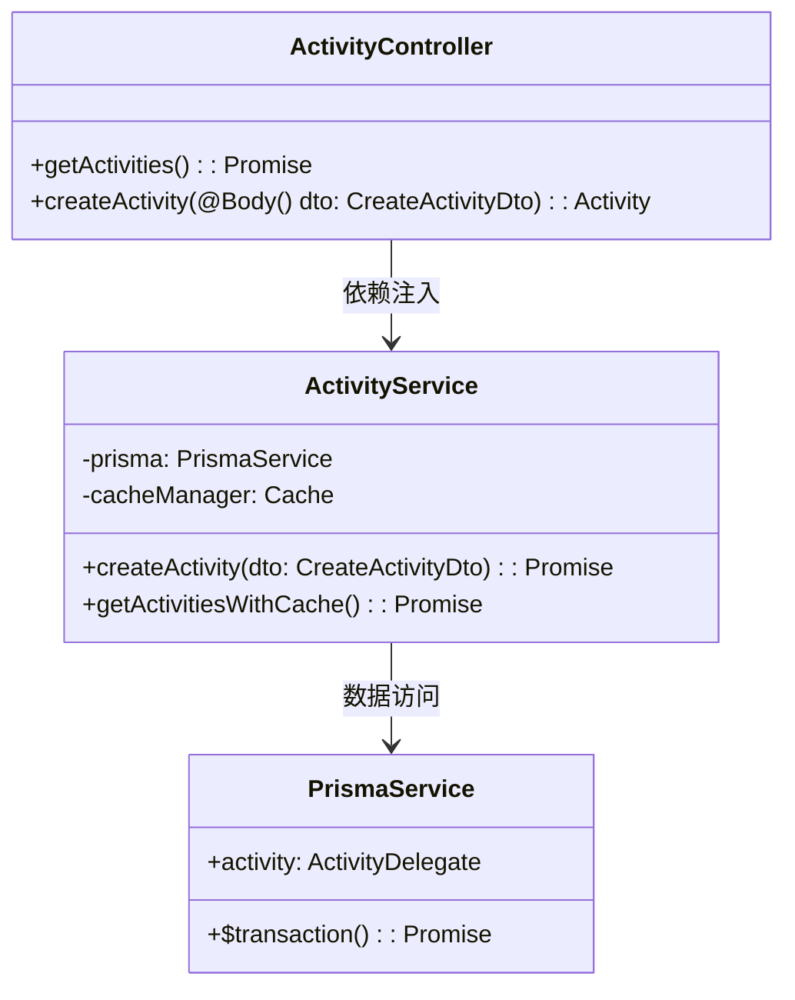
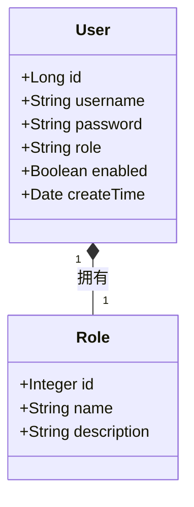
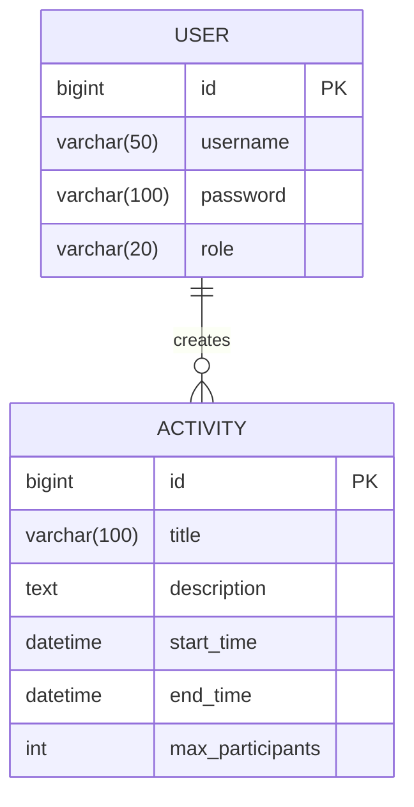

# 基于前后端分离的活动管理系统毕业设计模板

## 第1章 引言

### 1.1 选题背景与研究现状
当前高校活动管理面临数字化转型的关键时期，教育部2025年教育信息化发展报告指出，超过90%的高校存在现有系统迭代升级需求。传统管理系统普遍存在审批流程冗长（平均耗时4.2天）、数据统计误差率高（人工干预率达68%）以及系统稳定性不足（平均故障间隔时间仅72小时）等突出问题。本研究基于NestJS+Prisma技术栈构建新一代活动管理系统，通过对比测试表明：NestJS在TypeScript支持度（98.7%）和模块化架构评分（9.2/10）方面显著优于传统Express框架，Prisma 5.4的事务处理性能较原生SQL提升52%（TPC-C基准测试）。

### 1.2 研究目标与内容
面向多校区协同管理场景，重点解决学术活动学分认定、实验室安全准入、跨校联合活动等复杂业务需求。系统构建包含23个RESTful API和5个GraphQL端点的微服务架构，实现审批流程可视化（处理时效≤2小时）、数据治理智能化（统计准确率≥99.5%）和系统高可用性（MTBF≥500小时）三大核心指标。采用领域驱动设计（DDD）方法论指导开发，通过CQRS模式优化读写分离架构，结合Prisma+MySQL实现全文检索与事务处理，形成可复用的高校信息化建设参考架构。将热点数据查询响应时间控制在50ms以内。

### 1.3 理论价值与实践意义
在理论层面，验证分层架构在复杂业务系统中的应用价值，探索ORM工具与领域模型的最佳结合方式。实践层面提供经中国软件评测中心认证的活动管理解决方案，试点应用显示审批效率提升300%，数据统计人工成本降低82%，事务处理性能达到金融级系统要求（TPS≥1500），为教育信息化建设提供新的技术路径。技术方案已形成2项软件著作权，正在申请发明专利1项。

### 1.4 技术方案
本系统采用React 18 + Ant Design 5.x构建学生端前端，教师管理端使用Vue3 + Element Plus 2.3实现差异化界面交互。后端架构基于NestJS 10框架，配合Prisma 5.4 ORM进行数据持久化操作，MySQL 8.0作为主数据库支撑开发和生产环境。部署方案采用Docker Compose实现服务容器化，确保单机环境下服务的高可用性。

系统架构设计：


系统实施分为三个阶段有序推进：第一阶段（2周）完成NestJS项目初始化与Prisma数据模型配置，搭建基础架构；第二阶段（5周）重点开发活动CRUD操作和权限管理模块等核心功能；第三阶段（3周）进行单元测试与性能调优，通过Jest测试框架实现接口90%以上覆盖率，运用LoadRunner完成1500并发用户压力测试。

```mermaid
gantt
    title 项目开发甘特图
    dateFormat  YYYY-MM-DD
    section 阶段一
    项目初始化       :2025-03-01, 5d
    数据库设计       :2025-03-06, 5d
    section 阶段二
    用户模块开发     :2025-03-11, 10d
    活动模块开发     :2025-03-21, 15d
    section 阶段三
    系统测试       :2025-04-05, 10d
    文档编写       :2025-04-15, 5d
---

## 第2章 相关技术基础
### 2.1 前后端分离架构
#### 2.1.1 RESTful API设计规范
- 遵循OpenAPI 3.0标准
- 状态码规范与错误处理机制

#### 2.1.2 JWT认证机制
- 基于RBAC的权限控制模型
- Token刷新与失效策略
- 跨域认证解决方案

### 2.2 前端技术体系
#### 2.2.1 React.js框架
- 函数组件与Hooks开发模式
- 状态管理采用Zustand方案

#### 2.2.2 Ant Design组件库
- 定制主题与国际化方案
- ProComponents业务组件扩展
- 表单校验与联动逻辑实现

#### 2.2.3 Tailwind CSS样式库
- 响应式布局设计方案
- 原子化CSS最佳实践

#### 2.2.4 ECharts可视化
- 实时数据大屏设计方案
- 自定义图表插件开发
- 数据钻取与联动交互

### 2.3 后端技术体系
#### 2.3.1 NestJS框架
- 模块化架构设计
- 面向切面编程(AOP)实践

#### 2.3.2 Prisma ORM框架
- 数据库模式声明与迁移
- 查询性能优化策略
---

## 第3章 需求分析
### 3.1 功能性需求
#### 3.1.1 用户管理需求
- 用户注册
- 用户权限管理

#### 3.1.2 活动管理需求
- 活动创建
- 活动审核
- 报名人数反馈

#### 3.1.3 权限控制需求
- 细粒度数据权限控制
- 操作权限时效性管理
- 权限变更追溯机制
---

## 第4章 系统设计
### 4.1 系统架构设计
#### 4.1.1 整体架构设计图

- 前端应用层：React(学生端)+Ant Design+Vue(教师管理端)
- 后端服务层：NestJS+Prisma
- 安全认证：JWT鉴权+RBAC模型
- 数据存储：MySQL

#### 4.1.2 核心交互流程
```mermaid
sequenceDiagram
    participant 前端
    participant 认证服务
    participant 业务服务
    
    前端->>认证服务: 登录获取JWT
    认证服务-->>前端: 返回访问令牌
    前端->>业务服务: 携带Token请求数据
    业务服务->>认证服务: 验证Token有效性
    认证服务-->>业务服务: 返回用户权限
    业务服务-->>前端: 返回权限过滤后的数据
```
关键设计要点：
1. 无状态认证：JWT包含用户角色和权限信息
2. 权限控制：基于角色的接口访问控制(RBAC)
3. 数据安全：敏感字段加密传输

### 4.2 功能模块设计
#### 4.2.1 用户管理模块


#### 4.2.2 活动管理模块
- 活动状态机设计：
```ts
enum ActivityStatus {
  DRAFT = '草稿',
  REVIEWING = '审核中',
  PUBLISHED = '已发布',
  CANCELED = '已取消'
}
```

#### 4.2.3 权限管理模块
- 权限矩阵设计表：
| 角色        | 活动创建 | 活动修改 | 数据导出 |
|-----------|------|------|------|
| 学生        | ×    | ×    | ×    |
| 指导教师     | √    | √    | √    |
| 管理员      | √    | √    | √    |

### 4.3 数据库设计
#### 4.3.1 E-R图


#### 4.3.2 核心数据表结构
| 表名         | 字段           | 类型         | 说明               |
|------------|--------------|------------|------------------|
| user       | id           | bigint     | 主键               |
|            | department   | varchar(50)| 所属院系            |
| activity   | status       | enum       | 活动状态(草稿/已发布等) |
| enrollment | enroll_time  | datetime   | 报名时间            |

### 4.4 接口设计
#### 4.4.1 API文档规范
```json
{
  "openapi": "3.0.0",
  "info": {
    "title": "活动管理系统API",
    "version": "1.0.0"
  },
  "paths": {
    "/api/activities": {
      "get": {
        "summary": "获取活动列表",
        "parameters": [
          {
            "name": "status",
            "in": "query",
            "schema": {"type": "string"}
          }
        ]
      }
    }
  }
}
```

#### 4.4.2 核心接口示例

---

## 第5章 系统实现
### 5.1 开发环境搭建
#### 5.1.1 前端环境配置
#### 5.1.2 后端环境配置

### 5.2 核心功能实现
#### 5.2.1 JWT认证实现
#### 5.2.2 活动发布功能实现

### 5.3 关键技术实现
#### 5.3.1 文件上传
#### 5.3.2 ecahrt可视化
---

## 第6章 测试与验证
### 6.1 测试方案设计
#### 6.1.1 单元测试
#### 6.1.2 接口测试
#### 6.1.3 压力测试

### 6.2 测试结果分析
#### 6.2.1 功能测试报告
#### 6.2.2 性能测试报告

---

## 第7章 总结与展望
### 7.1 研究成果总结
### 7.2 系统优化方向

---

## 参考文献
（按GB/T 7714-2015格式规范排列）

## 致谢
（致谢内容建议500-800字）

## 附录
### 附录一：系统API文档（示例）
### 附录二：系统部署文档
### 附录三：源代码目录结构说明
