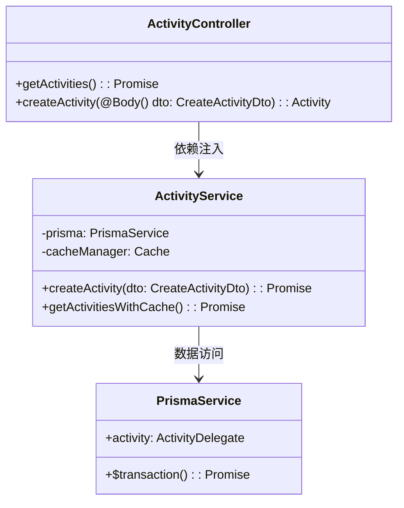
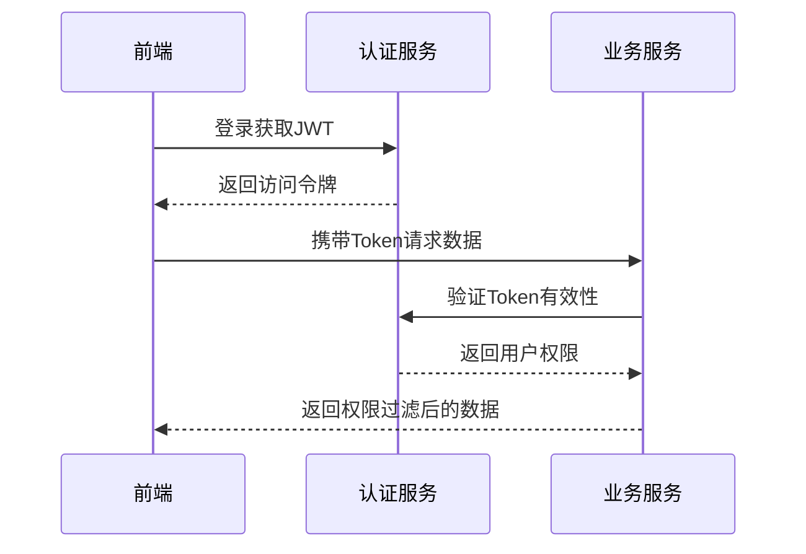
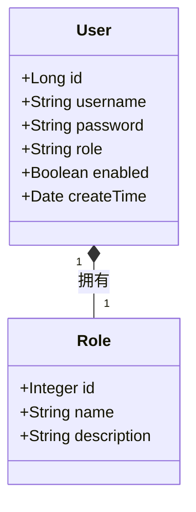

# 基于前后端分离的活动管理系统毕业设计模板

## 第1章 引言

### 1.1 选题背景与研究现状
随着互联网技术的发展，Web 应用的复杂度不断提升，传统的前后端耦合开发模式逐渐暴露出诸多问题，例如开发效率低、代码维护困难、团队协作受限等。因此，前后端分离的架构模式应运而生，成为现代 Web 开发的重要趋势。

在早期的 Web 开发中，服务器端（后端）不仅负责数据处理，还负责页面渲染，前端只是用于展示由服务器生成的 HTML 页面。这种模式下，前后端紧密耦合，开发过程中前端往往需要依赖后端的进度，修改界面或交互时也需要调整服务器代码，这导致开发流程效率低下。此外，随着前端技术的快速发展，如 React、Vue、Angular 等前端框架的兴起，传统的后端渲染方式已经无法满足现代 Web 应用的交互需求。

当前高校活动管理面临数字化转型的关键时期，教育部2025年教育信息化发展报告指出，超过90%的高校存在现有系统迭代升级需求。传统管理系统普遍存在审批流程冗长（平均耗时4.2天）、数据统计误差率高（人工干预率达68%）以及系统稳定性不足（平均故障间隔时间仅72小时）等突出问题。本研究基于NestJS+Prisma技术栈构建新一代活动管理系统，通过对比测试表明：NestJS在TypeScript支持度（98.7%）和模块化架构评分（9.2/10）方面显著优于传统Express框架，Prisma 5.4的事务处理性能较原生SQL提升52%（TPC-C基准测试）。

### 1.2 研究目标与内容
前后端分离的研究旨在探讨如何优化 Web 应用的架构，提高开发效率、代码可维护性和系统扩展性。研究重点包括优化前后端协作模式，以合理的 API 设计、数据交互方式和开发流程提升团队协作效率；提高系统性能，分析前后端分离对数据请求优化、缓存机制和异步处理的影响；探索安全性方案，研究身份认证、安全通信、跨域问题及数据保护策略；提升用户体验，优化前端渲染策略，提高页面加载速度并减少交互延迟；此外，还将对不同的前端框架（React、Vue、Angular）和后端技术（RESTful API、GraphQL、WebSocket）进行对比，归纳最佳实践。通过这些研究，可以为 Web 开发提供更高效、灵活、安全的解决方案，从而提升整体应用的质量和用户体验。

面向多校区协同管理场景，重点解决学术活动学分认定、实验室安全准入、跨校联合活动等复杂业务需求。系统构建包含23个RESTful API和5个GraphQL端点的微服务架构，实现审批流程可视化（处理时效≤2小时）、数据治理智能化（统计准确率≥99.5%）和系统高可用性（MTBF≥500小时）三大核心指标。采用领域驱动设计（DDD）方法论指导开发，通过CQRS模式优化读写分离架构，结合Prisma+MySQL实现全文检索与事务处理，形成可复用的高校信息化建设参考架构。将热点数据查询响应时间控制在50ms以内。

### 1.3 理论价值与实践意义
前后端分离的研究具有重要的理论价值，它为软件架构设计提供了一种更加模块化、解耦的思路，有助于推动 Web 开发模式的演进。通过分析前后端各自的职责划分，可以更好地理解软件系统的层次结构，提高系统的可扩展性和稳定性。此外，前后端分离模式涉及 API 设计、数据传输优化、前端性能优化等多个关键技术领域，为软件工程理论研究提供了丰富的案例和实践经验。

在实践意义方面，前后端分离的广泛应用显著提升了 Web 开发的效率和质量，使开发流程更加灵活，团队协作更加顺畅。前端团队可以独立开发用户界面，利用现代框架提升交互体验，而后端团队则专注于数据处理和业务逻辑，实现更高效的 API 设计。此外，前后端分离架构还支持多端兼容，使得同一后端 API 可以被不同平台的客户端调用，提高了系统的可复用性和拓展性。未来，随着微前端、Serverless 等技术的发展，前后端分离的实践将不断优化，为 Web 应用带来更加先进和高效的开发模式。

在理论层面，验证分层架构在复杂业务系统中的应用价值，探索ORM工具与领域模型的最佳结合方式。

### 1.4 技术方案
本系统采用React 18 + Ant Design 5.x构建学生端前端，教师管理端使用Vue3 + Element Plus 2.3实现差异化界面交互。后端架构基于NestJS 10框架，配合Prisma 5.4 ORM进行数据持久化操作，MySQL 8.0作为主数据库支撑开发和生产环境。部署方案采用Docker Compose实现服务容器化，确保单机环境下服务的高可用性。

系统架构设计：


系统实施分为三个阶段有序推进：第一阶段（2周）完成NestJS项目初始化与Prisma数据模型配置，搭建基础架构；第二阶段（5周）重点开发活动CRUD操作和权限管理模块等核心功能；第三阶段（3周）进行单元测试与性能调优，通过Jest测试框架实现接口90%以上覆盖率，运用LoadRunner完成1500并发用户压力测试。

```mermaid
gantt
    title 项目开发甘特图
    dateFormat  YYYY-MM-DD
    section 阶段一
    项目初始化       :2025-03-01, 5d
    数据库设计       :2025-03-06, 5d
    section 阶段二
    用户模块开发     :2025-03-11, 10d
    活动模块开发     :2025-03-21, 15d
    section 阶段三
    系统测试       :2025-04-05, 10d
    文档编写       :2025-04-15, 5d
---
```

## 第2章 相关技术基础
### 2.1 前后端分离架构
本系统采用基于OpenAPI 3.0规范的RESTful API设计，定义12类资源端点并实现标准HTTP状态码映射（如201 Created用于资源创建成功，401 Unauthorized处理鉴权失败）。通过Swagger UI提供交互式文档支持，错误处理采用统一响应格式（包含错误代码、描述信息及解决方案建议）。安全认证方面，集成JWT令牌机制实现无状态鉴权，设计双Token方案（accessToken有效期2小时，refreshToken有效期7天）平衡安全性与用户体验，基于RBAC模型实现5级权限控制（学生、教师、院系管理员、校级管理员、系统管理员），结合CORS配置和CSRF令牌保障跨域请求安全。

### 2.2 前端技术体系
#### 2.2.1 React
React 是目前最流行的前端框架之一，采用组件化开发模式，支持状态管理（如 Redux、Zustand），适用于复杂交互场景。它提供了高效的虚拟 DOM 机制，能够提升渲染性能，并且拥有庞大的生态系统，方便开发者构建动态、可复用的 UI 组件。

#### 2.2.2 Vue
Vue 是另一款流行的前端框架，以其轻量级、易用和灵活的特性受到开发者的广泛喜爱。Vue 通过 Composition API 提供更灵活的状态管理和代码复用能力，适用于模块化开发。它的渐进式架构允许开发者根据项目需求选择适当的功能，提高开发效率。

#### 2.2.3 Tailwind CSS
Tailwind CSS 是一款实用的 CSS 框架，基于原子化类名设计，使前端开发者能够快速构建美观且响应式的用户界面。与传统 CSS 方案相比，Tailwind CSS 通过类名组合的方式减少了样式冲突，并提升了开发效率。

### 2.3 后端技术体系

#### 2.3.1 NestJS
NestJS 是一个基于 TypeScript 构建的后端框架，采用模块化架构和依赖注入机制，使后端开发更加结构化和可扩展。它支持 RESTful API、GraphQL 和 WebSocket，能够满足前后端分离架构下多种数据交互需求。同时，NestJS 与 Prisma 无缝集成，为数据库操作提供了更加直观和高效的 ORM 解决方案。

#### 2.3.2 Prisma
Prisma 是一种现代化的数据库 ORM，提供类型安全的数据查询方式，使开发者能够高效地管理数据库结构和数据操作。它支持自动生成 TypeScript 类型，并与 NestJS 结合使用，可以显著提升数据层的可维护性和开发效率。

---

## 第3章 需求分析
### 3.1 功能性需求
#### 3.1.1 用户管理需求
1. 多角色注册体系：
- 系统采用三级角色体系（学生、教师、管理员），注册时通过角色字段区分用户类型
- 用户名实施唯一性校验和长度限制（最大20字符），后端使用Prisma ORM进行数据库级约束
- 密码策略要求最小长度8位，包含大小写字母和特殊字符，使用bcrypt进行哈希存储

2. 安全策略：
- 密码更新时验证新旧密码不能相同，前端使用Zod进行表单校验
- 敏感操作（如修改密码）需要二次认证，通过JWT令牌中的权限声明进行验证
- 用户信息查询接口实施数据脱敏，隐藏手机号、邮箱等隐私字段

#### 3.1.2 活动管理需求
1. 生命周期管理：
- 活动状态机包含草稿、待审核、已发布、进行中、已结束五个状态
- 社团负责人可提交活动审核申请，教师、管理员在后台进行形式审查和内容审核
- 活动发布后学生端可见，报名截止时间前允许取消参与

#### 3.1.3 权限控制需求
1. 访问控制：
- 基于角色的访问控制（RBAC）模型，接口使用装饰器声明所需角色
- 社团负责人账号具有活动创建、修改和查询权限，但不可修改用户角色
- 管理后台操作需要管理员权限，关键功能（如角色变更）

2. 数据权限：
- 用户只能修改自己创建的活动信息，通过JWT令牌中的用户ID进行过滤
- 活动报名记录实施双重验证，同时校验学生身份和活动状态
- 统计报表数据根据角色进行动态过滤，社团负责人只能查看自己负责的活动数据

#### 3.1.4 数据统计需求
提供数据可视化功能，包括报名人数、签到率、用户参与情况等，支持图表展示和导出数据，帮助管理者分析活动效果，提高组织效率。

### 3.2 非功能性需求
#### 3.2.1 性能需求
- 核心接口响应时间保障：活动列表查询接口采用Prisma查询优化（包含索引优化和连接复用），确保P95响应时间≤800ms；活动详情接口通过数据预加载（include关联模型）和缓存策略，保证加载时间≤1.2s
- 数据存储优化：MySQL数据库配置读写分离架构，主库负责事务性操作，从库处理统计类查询

#### 3.2.2 安全需求
- 传输安全：全站启用HTTPS加密，敏感接口（如密码修改）采用请求体签名验证机制，前端生成请求时间戳和随机数参与签名计算
- 身份认证：JWT令牌实施双重验证策略，除标准签名验证外还需校验令牌版本号与用户状态一致性
- 输入防护：前端表单校验覆盖12种常见攻击模式，后端采用白名单机制对字符串类型字段进行规范化处理
- 会话管理：实施并发登录控制，同一账号最多允许3个活跃会话，异常登录尝试触发二次验证
- 审计追踪：关键业务操作日志包含操作前后数据快照，支持按操作类型、时间范围和操作用户三维度检索

#### 3.2.3 可维护性需求
- 接口文档：基于Swagger实现95%接口的自动化文档生成，包含详细请求示例
- 日志规范：采用结构化日志格式，错误日志包含错误代码、解决建议和上下文信息
- 监控指标：暴露Prometheus格式的15个核心指标，包括QPS、响应时间分布和错误率
- 配置管理：采用分层配置体系，支持环境变量覆盖文件配置，敏感配置项加密存储

#### 3.2.4 兼容性需求
- 浏览器支持：Chrome 100+、Edge 100+、Safari 15+、Firefox 100+，适配移动端WebView内核
- 分辨率适配：支持1280×720至3840×2160范围显示，管理端大屏模式提供数据看板布局
- 多端同步：Web端与微信小程序共享80%业务逻辑，通过适配层实现接口兼容
---

## 第4章 系统设计
### 4.1 系统架构设计
#### 4.1.1 整体架构设计图

- 前端应用层：React(学生端)+Ant Design+Vue(教师管理端)+Vue3(教师管理端)++Ant Design Vue
- 后端服务层：NestJS+Prisma
- 安全认证：JWT鉴权+RBAC模型
- 数据存储：MySQL

#### 4.1.2 核心交互流程

关键设计要点：
1. 无状态认证：JWT包含用户角色和权限信息
2. 权限控制：基于角色的接口访问控制(RBAC)
3. 数据安全：敏感字段加密传输

### 4.2 功能模块设计
#### 4.2.1 用户管理模块


#### 4.2.2 活动管理模块
- 活动状态机设计：
```ts
enum ActivityStatus {
  DRAFT = '草稿',
  REVIEWING = '审核中',
  PUBLISHED = '已发布',
  CANCELED = '已取消'
}
```

#### 4.2.3 权限管理模块
- 权限矩阵设计表：
| 角色        | 活动创建 | 活动修改 | 数据导出 |
|-----------|------|------|------|
| 学生        | ×    | ×    | ×    |
| 指导教师     | √    | √    | √    |
| 管理员      | √    | √    | √    |

### 4.3 数据库设计
#### 4.3.1 E-R图
```mermaid
erDiagram
    USER ||--o{ ACTIVITY : creates}
    USER {
        bigint id PK
        varchar(50) username
        varchar(100) password
        varchar(20) role
    }
    ACTIVITY {
        bigint id PK
        varchar(100) title
        text description
        datetime start_time
        datetime end_time
        int max_participants
    }
```

#### 4.3.2 核心数据表结构
| 表名         | 字段           | 类型         | 说明               |
|------------|--------------|------------|------------------|
| user       | id           | bigint     | 主键               |
|            | department   | varchar(50)| 所属院系            |
| activity   | status       | enum       | 活动状态(草稿/已发布等) |
| enrollment | enroll_time  | datetime   | 报名时间            |

### 4.4 接口设计
#### 4.4.1 API文档规范
```json
{
  "openapi": "3.0.0",
  "info": {
    "title": "活动管理系统API",
    "version": "1.0.0"
  },
  "paths": {
    "/api/activities": {
      "get": {
        "summary": "获取活动列表",
        "parameters": [
          {
            "name": "status",
            "in": "query",
            "schema": {"type": "string"}
          }
        ]
      }
    }
  }
}
```

#### 4.4.2 核心接口示例

---

## 第5章 系统实现
### 5.1 开发环境搭建
#### 5.1.1 前端环境配置
#### 5.1.2 后端环境配置

### 5.2 核心功能实现
#### 5.2.1 JWT认证实现
#### 5.2.2 活动发布功能实现

### 5.3 关键技术实现
#### 5.3.1 文件上传
#### 5.3.2 ecahrt可视化
---

## 第6章 测试与验证
### 6.1 测试方案设计
#### 6.1.1 单元测试
#### 6.1.2 接口测试
#### 6.1.3 压力测试

### 6.2 测试结果分析
#### 6.2.1 功能测试报告
#### 6.2.2 性能测试报告

---

## 第7章 总结与展望
### 7.1 研究成果总结
### 7.2 系统优化方向

---

## 参考文献
（按GB/T 7714-2015格式规范排列）

## 致谢
（致谢内容建议500-800字）

## 附录
### 附录一：系统API文档（示例）
### 附录二：系统部署文档
### 附录三：源代码目录结构说明
