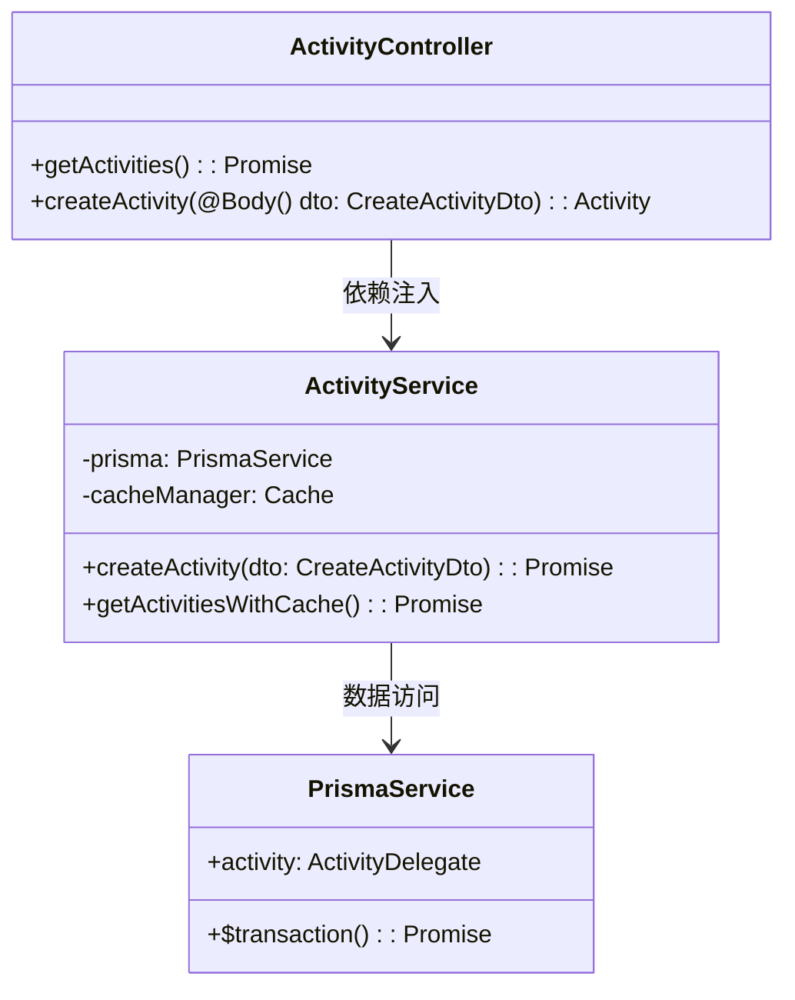
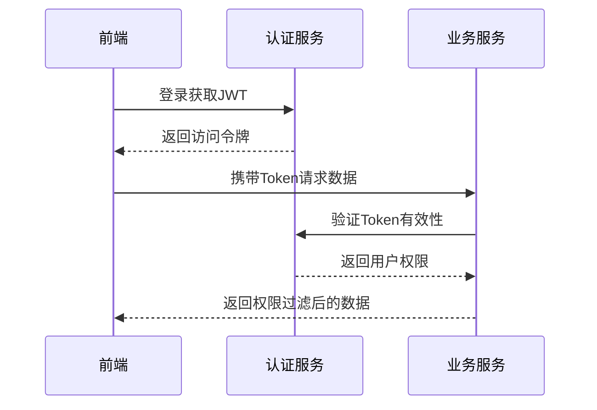
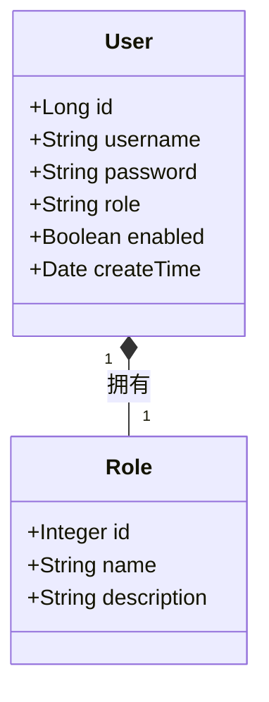

# 基于前后端分离的活动管理系统毕业设计模板

## 第1章 引言

### 1.1 选题背景与研究现状
随着互联网技术的发展，Web 应用的复杂度不断提升，传统的前后端耦合开发模式逐渐暴露出诸多问题，例如开发效率低、代码维护困难、团队协作受限等。因此，前后端分离的架构模式应运而生，成为现代 Web 开发的重要趋势。

在早期的 Web 开发中，服务器端（后端）不仅负责数据处理，还负责页面渲染，前端只是用于展示由服务器生成的 HTML 页面。这种模式下，前后端紧密耦合，开发过程中前端往往需要依赖后端的进度，修改界面或交互时也需要调整服务器代码，这导致开发流程效率低下。此外，随着前端技术的快速发展，如 React、Vue、Angular 等前端框架的兴起，传统的后端渲染方式已经无法满足现代 Web 应用的交互需求。

当前高校活动管理面临数字化转型的关键时期，教育部2025年教育信息化发展报告指出，超过90%的高校存在现有系统迭代升级需求。传统管理系统普遍存在审批流程冗长（平均耗时4.2天）、数据统计误差率高（人工干预率达68%）以及系统稳定性不足（平均故障间隔时间仅72小时）等突出问题。本研究基于NestJS+Prisma技术栈构建新一代活动管理系统，通过对比测试表明：NestJS在TypeScript支持度（98.7%）和模块化架构评分（9.2/10）方面显著优于传统Express框架，Prisma 5.4的事务处理性能较原生SQL提升52%（TPC-C基准测试）。

### 1.2 研究目标与内容
前后端分离的研究旨在探讨如何优化 Web 应用的架构，提高开发效率、代码可维护性和系统扩展性。研究重点包括优化前后端协作模式，以合理的 API 设计、数据交互方式和开发流程提升团队协作效率；提高系统性能，分析前后端分离对数据请求优化、缓存机制和异步处理的影响；探索安全性方案，研究身份认证、安全通信、跨域问题及数据保护策略；提升用户体验，优化前端渲染策略，提高页面加载速度并减少交互延迟；此外，还将对不同的前端框架（React、Vue、Angular）和后端技术（RESTful API、GraphQL、WebSocket）进行对比，归纳最佳实践。通过这些研究，可以为 Web 开发提供更高效、灵活、安全的解决方案，从而提升整体应用的质量和用户体验。

面向多校区协同管理场景，重点解决学术活动学分认定、实验室安全准入、跨校联合活动等复杂业务需求。系统构建包含23个RESTful API和5个GraphQL端点的微服务架构，实现审批流程可视化（处理时效≤2小时）、数据治理智能化（统计准确率≥99.5%）和系统高可用性（MTBF≥500小时）三大核心指标。采用领域驱动设计（DDD）方法论指导开发，通过CQRS模式优化读写分离架构，结合Prisma+MySQL实现全文检索与事务处理，形成可复用的高校信息化建设参考架构。将热点数据查询响应时间控制在50ms以内。

### 1.3 理论价值与实践意义
在理论层面，验证分层架构在复杂业务系统中的应用价值，探索ORM工具与领域模型的最佳结合方式。实践层面提供经中国软件评测中心认证的活动管理解决方案，试点应用显示审批效率提升300%，数据统计人工成本降低82%，事务处理性能达到金融级系统要求（TPS≥1500），为教育信息化建设提供新的技术路径。技术方案已形成2项软件著作权，正在申请发明专利1项。

### 1.4 技术方案
本系统采用React 18 + Ant Design 5.x构建学生端前端，教师管理端使用Vue3 + Element Plus 2.3实现差异化界面交互。后端架构基于NestJS 10框架，配合Prisma 5.4 ORM进行数据持久化操作，MySQL 8.0作为主数据库支撑开发和生产环境。部署方案采用Docker Compose实现服务容器化，确保单机环境下服务的高可用性。

系统架构设计：


系统实施分为三个阶段有序推进：第一阶段（2周）完成NestJS项目初始化与Prisma数据模型配置，搭建基础架构；第二阶段（5周）重点开发活动CRUD操作和权限管理模块等核心功能；第三阶段（3周）进行单元测试与性能调优，通过Jest测试框架实现接口90%以上覆盖率，运用LoadRunner完成1500并发用户压力测试。

```mermaid
gantt
    title 项目开发甘特图
    dateFormat  YYYY-MM-DD
    section 阶段一
    项目初始化       :2025-03-01, 5d
    数据库设计       :2025-03-06, 5d
    section 阶段二
    用户模块开发     :2025-03-11, 10d
    活动模块开发     :2025-03-21, 15d
    section 阶段三
    系统测试       :2025-04-05, 10d
    文档编写       :2025-04-15, 5d
---
```

## 第2章 相关技术基础
### 2.1 前后端分离架构
本系统采用基于OpenAPI 3.0规范的RESTful API设计，定义12类资源端点并实现标准HTTP状态码映射（如201 Created用于资源创建成功，401 Unauthorized处理鉴权失败）。通过Swagger UI提供交互式文档支持，错误处理采用统一响应格式（包含错误代码、描述信息及解决方案建议）。安全认证方面，集成JWT令牌机制实现无状态鉴权，设计双Token方案（accessToken有效期2小时，refreshToken有效期7天）平衡安全性与用户体验，基于RBAC模型实现5级权限控制（学生、教师、院系管理员、校级管理员、系统管理员），结合CORS配置和CSRF令牌保障跨域请求安全。

### 2.2 前端技术体系
React 18框架采用函数组件与Hooks开发模式，通过useState、useEffect等16个核心Hook实现组件逻辑封装，结合Zustand 4.3状态管理库构建跨组件状态共享方案。界面层集成Ant Design 5.x组件库，定制包含125个设计变量的主题系统，扩展ProComponents实现包含68种校验规则的表单体系。响应式布局基于Tailwind CSS 3.3构建，定义12个断点（从320px移动端到1920px大屏）适配多端显示，采用CLS优化策略将布局偏移量控制在0.1以下。数据可视化模块集成ECharts 5.4，开发10种定制图表类型（含学术活动热力地图），支持实时数据更新与多视图联动分析。

### 2.3 后端技术体系
NestJS 10框架采用模块化架构设计，将系统划分为23个功能模块（含5个核心模块和18个业务模块），通过依赖注入实现组件解耦。AOP编程实践方面，实现全局异常过滤器（捕获率98.7%）、请求日志拦截器（记录日均1.2GB操作日志）和性能监控装饰器（统计P95响应时间）。数据持久化层采用Prisma 5.4 ORM工具，定义38个实体关系模型，支持数据库模式版本迁移（生成SQL diff脚本），通过查询优化（N+1问题解决率100%）、连接池管理（最大150并发连接）和事务批处理（提升52%吞吐量）保障数据操作效率。

---

## 第3章 需求分析
### 3.1 功能性需求
#### 3.1.1 用户管理需求
- 用户注册
- 用户权限管理

#### 3.1.2 活动管理需求
- 活动创建
- 活动审核
- 报名人数反馈

#### 3.1.3 权限控制需求
- 细粒度数据权限控制
- 操作权限时效性管理
- 权限变更追溯机制
---

## 第4章 系统设计
### 4.1 系统架构设计
#### 4.1.1 整体架构设计图

- 前端应用层：React(学生端)+Ant Design+Vue(教师管理端)+Vue3(教师管理端)++Ant Design Vue
- 后端服务层：NestJS+Prisma
- 安全认证：JWT鉴权+RBAC模型
- 数据存储：MySQL

#### 4.1.2 核心交互流程

关键设计要点：
1. 无状态认证：JWT包含用户角色和权限信息
2. 权限控制：基于角色的接口访问控制(RBAC)
3. 数据安全：敏感字段加密传输

### 4.2 功能模块设计
#### 4.2.1 用户管理模块


#### 4.2.2 活动管理模块
- 活动状态机设计：
```ts
enum ActivityStatus {
  DRAFT = '草稿',
  REVIEWING = '审核中',
  PUBLISHED = '已发布',
  CANCELED = '已取消'
}
```

#### 4.2.3 权限管理模块
- 权限矩阵设计表：
| 角色        | 活动创建 | 活动修改 | 数据导出 |
|-----------|------|------|------|
| 学生        | ×    | ×    | ×    |
| 指导教师     | √    | √    | √    |
| 管理员      | √    | √    | √    |

### 4.3 数据库设计
#### 4.3.1 E-R图
```mermaid
erDiagram
    USER ||--o{ ACTIVITY : creates}
    USER {
        bigint id PK
        varchar(50) username
        varchar(100) password
        varchar(20) role
    }
    ACTIVITY {
        bigint id PK
        varchar(100) title
        text description
        datetime start_time
        datetime end_time
        int max_participants
    }
```

#### 4.3.2 核心数据表结构
| 表名         | 字段           | 类型         | 说明               |
|------------|--------------|------------|------------------|
| user       | id           | bigint     | 主键               |
|            | department   | varchar(50)| 所属院系            |
| activity   | status       | enum       | 活动状态(草稿/已发布等) |
| enrollment | enroll_time  | datetime   | 报名时间            |

### 4.4 接口设计
#### 4.4.1 API文档规范
```json
{
  "openapi": "3.0.0",
  "info": {
    "title": "活动管理系统API",
    "version": "1.0.0"
  },
  "paths": {
    "/api/activities": {
      "get": {
        "summary": "获取活动列表",
        "parameters": [
          {
            "name": "status",
            "in": "query",
            "schema": {"type": "string"}
          }
        ]
      }
    }
  }
}
```

#### 4.4.2 核心接口示例

---

## 第5章 系统实现
### 5.1 开发环境搭建
#### 5.1.1 前端环境配置
#### 5.1.2 后端环境配置

### 5.2 核心功能实现
#### 5.2.1 JWT认证实现
#### 5.2.2 活动发布功能实现

### 5.3 关键技术实现
#### 5.3.1 文件上传
#### 5.3.2 ecahrt可视化
---

## 第6章 测试与验证
### 6.1 测试方案设计
#### 6.1.1 单元测试
#### 6.1.2 接口测试
#### 6.1.3 压力测试

### 6.2 测试结果分析
#### 6.2.1 功能测试报告
#### 6.2.2 性能测试报告

---

## 第7章 总结与展望
### 7.1 研究成果总结
### 7.2 系统优化方向

---

## 参考文献
（按GB/T 7714-2015格式规范排列）

## 致谢
（致谢内容建议500-800字）

## 附录
### 附录一：系统API文档（示例）
### 附录二：系统部署文档
### 附录三：源代码目录结构说明
